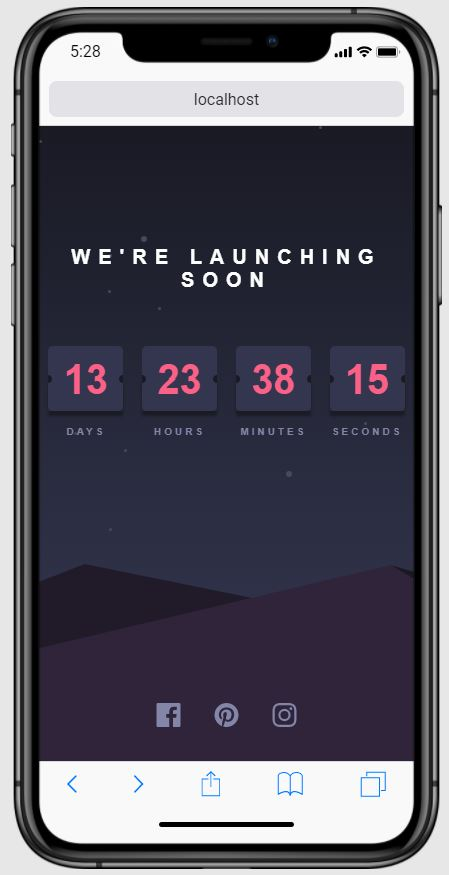

# Frontend Mentor - Launch countdown timer

This is a solution to the [Launch countdown timer challenge on Frontend Mentor](https://www.frontendmentor.io/challenges/launch-countdown-timer-N0XkGfyz-).

## Table of contents

- [Overview](#overview)
  - [The challenge](#the-challenge)
  - [Screenshot](#screenshot)
  - [Links](#links)
- [My process](#my-process)
- [Author](#author)

## Overview

### The challenge

Users should be able to:

- See hover states for all interactive elements on the page
- See a live countdown timer that ticks down every second (start the count at 14 days)

### Screenshot

### Links

- GitHub Repo URL: [https://github.com/jesusrmz19/countdown-timer](https://github.com/jesusrmz19/countdown-timer)
- Live Site URL: [https://launchcounter.netlify.app/](https://launchcounter.netlify.app/)

## My process

### Built with

- Semantic HTML5 markup
- CSS custom properties
- Flexbox
- CSS Grid

## Author

- Website - [Jesus Ramirez](https://jesusrmz.com/)
- Frontend Mentor - [@jesusrmz19](https://www.frontendmentor.io/profile/jesusrmz19)
- CodePen - [@jesusrmz](https://codepen.io/jesusrmz)
- Twitter - [@jesusrmz\_](https://twitter.com/jesusrmz_)
